# Capstone Project for Udacity - Azure Machine Learning Engineer Nanodegree

For this capstone project the requirements were to select an external dataset which is not available on Azure and develop multiple Machine Learning models using AutoML and tune a model using Hyperdrive. The best performing model will then be deployed as a REST Endpoint which will be available for use.

## Project Set Up and Installation
Udacity provided the required azure ml workspace necessary to run the code. For anyone trying to replicate my work you need to get an Azure ML Instance before you run the jupyter notebooks provided in this repo. After that you will need to create a compute instance which is named 'udacity' for this run. 
The experiment was created and azure ml studio was used to run Azure ML Notebooks which inturn ran on coumte vms and calulations were done via the jupyter notebook on a 4 node cluster of cloud based VMs of size STANDARD_D2_V2. To avoid duplication same compute resourses and datset created were used for both hyperdrive method and automl method.

## Dataset

### Overview
I got this data set from Kaggle. The hyperlink for the [dataset](https://www.kaggle.com/bobbyscience/league-of-legends-diamond-ranked-games-10-min) is provided. 
League of Legends is a MOBA (multiplayer online battle arena) where 2 teams (blue and red) face off. There are 3 lanes, a jungle, and 5 roles. The goal is to take down the enemy Nexus to win the game.
This dataset contains the first 10min. stats of approx. 10k ranked games (SOLO QUEUE) from a high ELO (DIAMOND I to MASTER). Players have roughly the same level.
Each game is unique. There are 19 features per team (38 in total) collected after 10min in-game. This includes kills, deaths, gold, experience, level… 

### Task
The column blueWins is the target value (the value we are trying to predict). A value of 1 means the blue team has won. 0 otherwise.
This means the model we will be training a binary classification model. For this project all of the 38 features provided are used. 

### Access
I created an account on Kaggle and downloaded the dataset to my local machine and uploaded it on this Git project. Link for the dataset is [here](https://github.com/AishuDas/nd00333-capstone/blob/master/starter_file/high_diamond_ranked_10min.csv)
After doing this I registered the data from the Git using TabularDatasetFactory. You can see the code for it in the [automl.ipynb](https://github.com/AishuDas/nd00333-capstone/blob/master/starter_file/automl.ipynb) and [hyperparameter_tuning.ipynb](https://github.com/AishuDas/nd00333-capstone/blob/master/starter_file/hyperparameter_tuning.ipynb) notebooks.

## Automated ML
I refered to the following link for the input parameters. https://docs.microsoft.com/en-us/python/api/azureml-train-automl-client/azureml.train.automl.automlconfig.automlconfig?view=azure-ml-py
Upon reading the various parameters I chose the following

Primary_metric as accuracy as Accuracy was the objective function
I set Max concurrent iterations as 10 to parallize the automl model building process
I set experiment timeout to 25 minutes so it doesn't go on building the model for a really long time.
I set the task as classification
I provided the label column name
The training dataset
The compute target to be used for computing
Cross_validation as 5

### Results
The results showed me that the best performing model is a Voting Ensemble Model and I acheived a training accuracy of 73.57%.
I could have done some feature engineering and created some derived features which may have improved the performance.

Upon successful run of the AutoML Run, I used the User Interface to show the completed run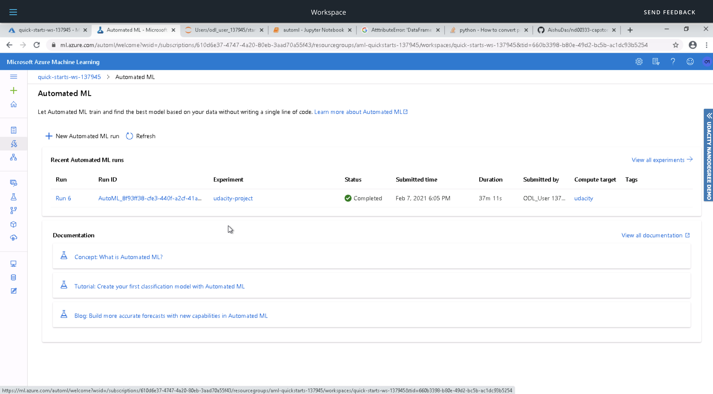
In the jupyter notebook,there is a widget to view the progress of the run. Here is a screenshot highlighting the same 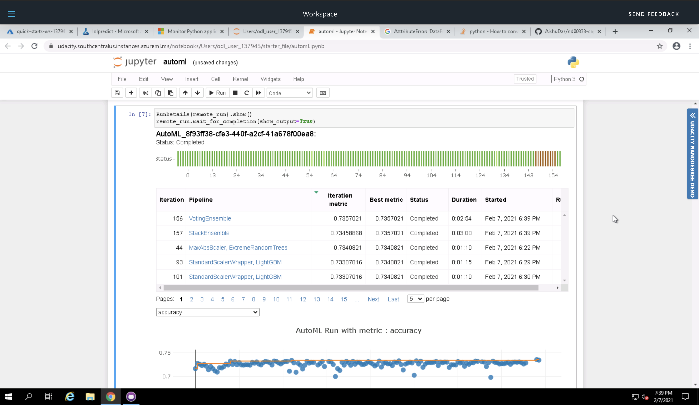
The widget also provides graphs to show the performance. Here is a screenshot of the same 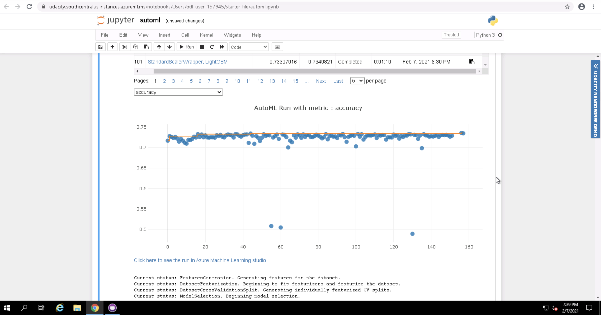. Here is a list of models that were trained.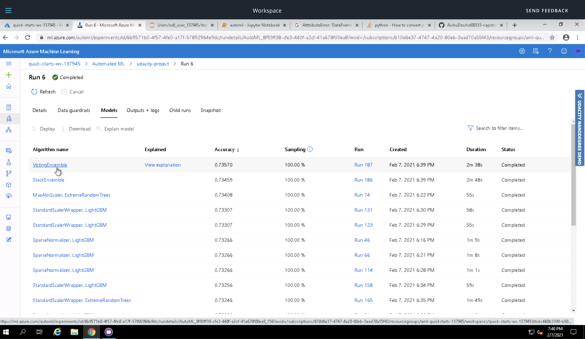

## Hyperparameter Tuning
Since the problem was that of a Binary Classification so I chose a Logistic Regression Model. Upon reading the [Scikit-Learn API for Logistic Regression](https://scikit-learn.org/stable/modules/generated/sklearn.linear_model.LogisticRegression.html) and looking at the various parameters that can be tuned I selected three parameters C, max_iter, n_jobs.
I used RandomParameterSampling for all three of these so the hypertuning selects all of the possible choice at random.
I used MedianStoppingPolicy for early termination as this will help in coverging fast and save compute cost and time.

### Results
My best performing model had an accuracy of 72.4%. For this model the regularization strength is 2.0 and the number of iterations is 120 and Number of CPU cores used is 2. You can see the same in the Hyperdrive notebook.
I could have improved this performance by doing a few things
- Tuning other parameters like penalty, solver
- I could also use Uniform Selection for C instead of doing a choice.
- I could also try using a more sophisticated model instead of Logistic Regression. Maybe use the nest performing model of AutoML and tune it's parameters.

Upon successful run of the hyperdrive model, I used the User Interface to show the completed run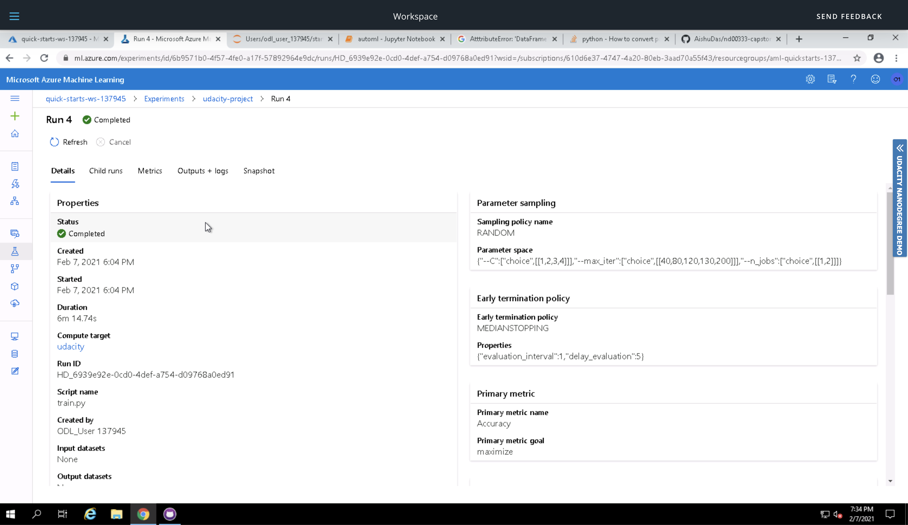
In the jupyter notebook,there is a widget to view the progress of the run. Here is a screenshot highlighting the same 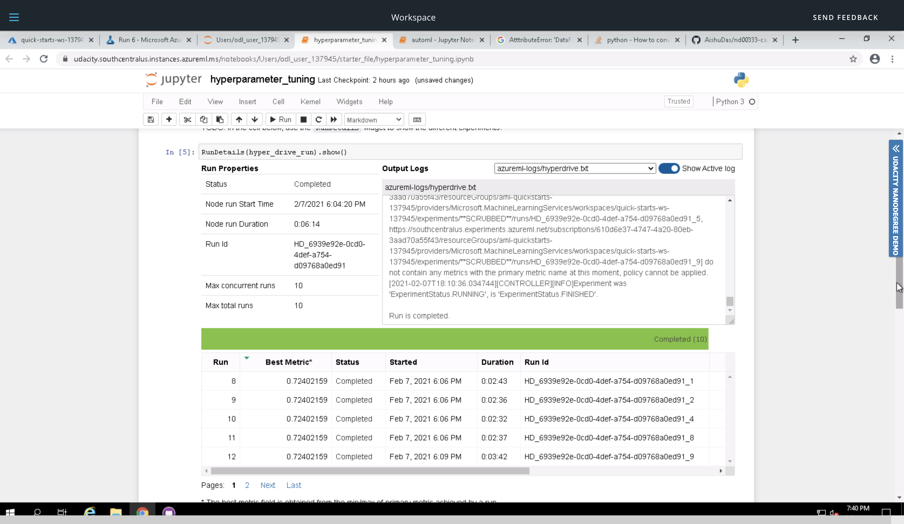
The widget also provides graphs to show the performance. Here is a screenshot of the same 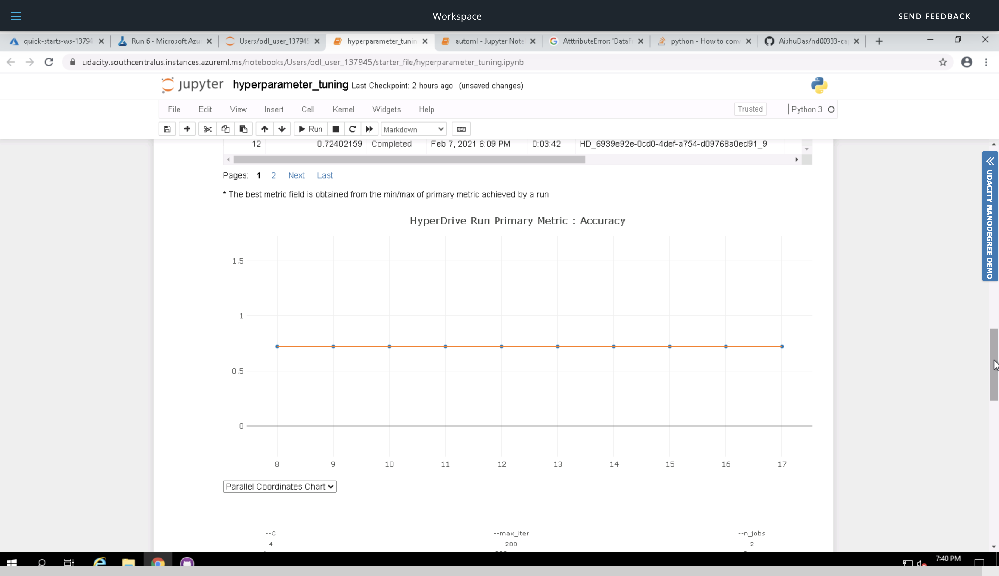
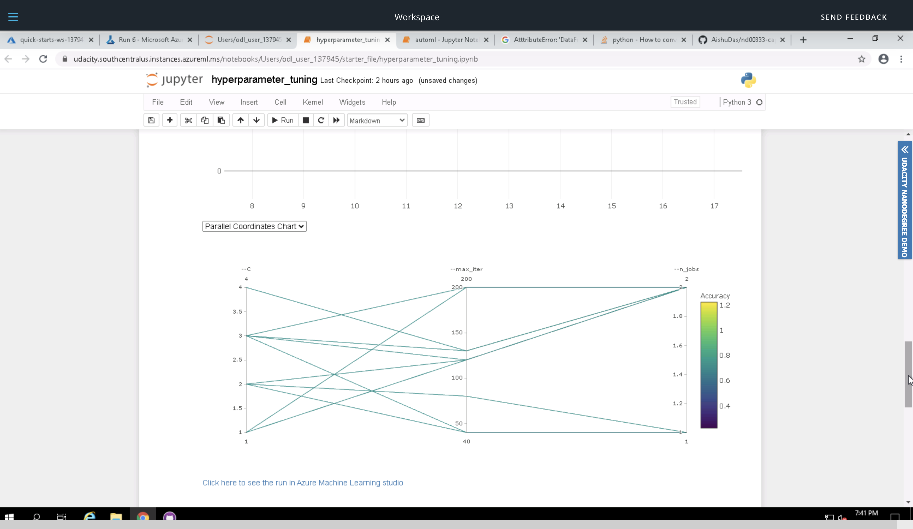. Here is a list of models that were trained.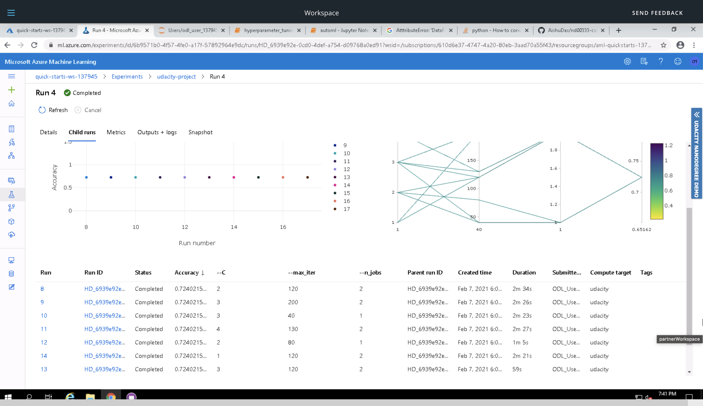

## Model Deployment
The AutoML model was deployed since it had a higher accuracy. For that first I registered the model and confirmed that on the User Interface as shown here 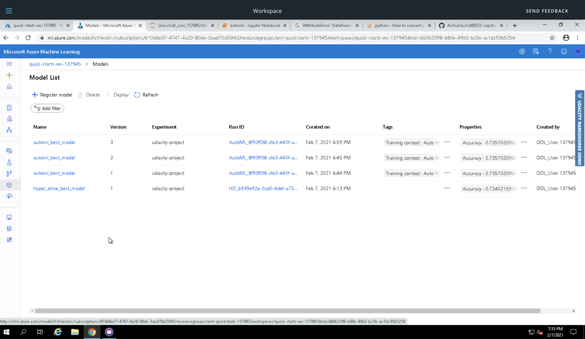
Once the model was registered a scoring script was created which is provided [here](score.py)
The model is deployed utilizing Azure Container Instance as a WebService.
The scoring script and the environment was provided for the Inference.
Cpu_cores and memory_gb are instated as 1 for the arrangement design.
The model is effectively sent as a web administration and a REST endpoint is made with status Healthy. 
A scoring uri is likewise produced to test the endpoint.
To test the service a POST Request was created and a sample row from the dataset is selected having all the fields mentioned in the dataset.

## Screen Recording
The Screencast for this can be seen [here](https://youtu.be/W7oNDuE02dU)

## Standout Suggestions
Out of all the standout suggestion I implemented the following:

1. Enabled Application Insights.
In the screenshot you can see the endpoint result
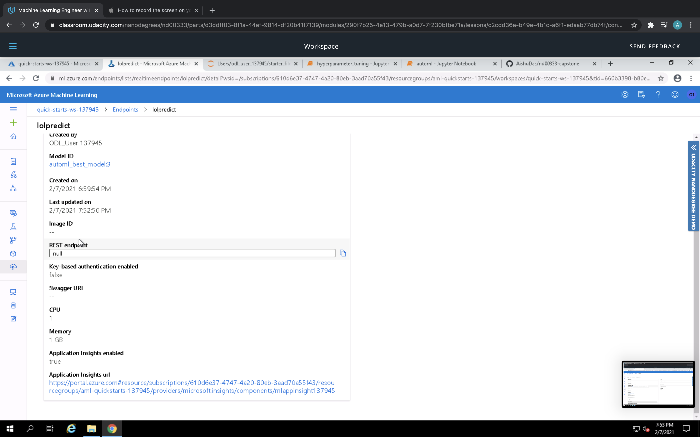
   The code for this available in the [automl.ipynb](https://github.com/AishuDas/nd00333-capstone/blob/master/starter_file/automl.ipynb) Cell 48
    
2. Save model as ONNX format
I have written the code for this which is available in the [automl.ipynb](https://github.com/AishuDas/nd00333-capstone/blob/master/starter_file/automl.ipynb) after Cell 16. I dont have a screenshot for this.